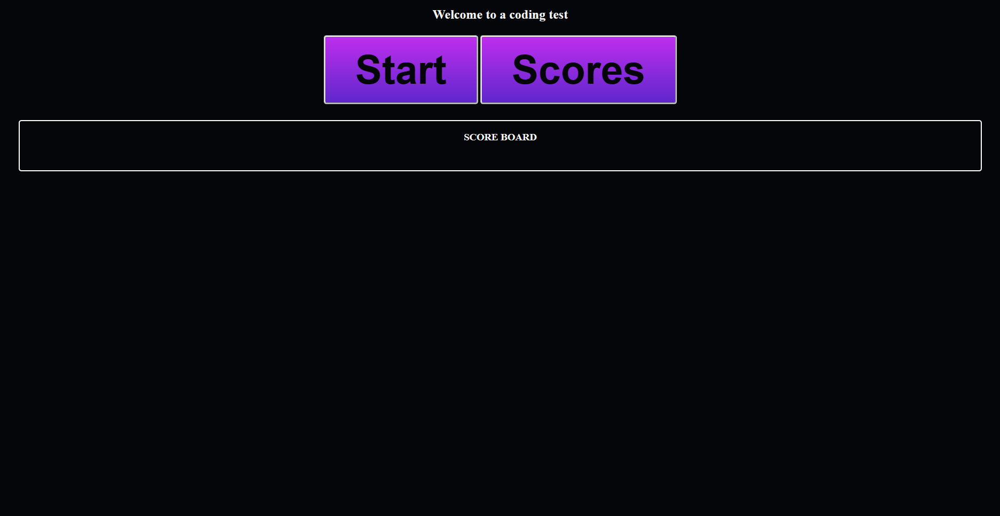

# Coding-test
this a coding test for JS
_____
## how the web app works
* when clicking the start button.
when pressing the start button the test begans with a series of 4 questions with 10 seconds to answer each question.
* if answer is incorrect time is subtracted from the timer
* you can after save your score.
------
                                          click on link to direct you to this webpage
when loading up the [website](https://heav3n21.github.io/Coding-test.github.io/) you will be presented with this page showing you a score board if players have played before and a start button to began the test.

* to inspect the page sipmly press cmd+option+I if your on mac. If on windows press CTRL+SHIFT+I or simply left click anywhere on the webpage and press inspect.